<h1 align="center">
  <span style="background: linear-gradient(90deg, #00f5d4, #00bbf9, #9b5de5, #f15bb5); -webkit-background-clip: text; -webkit-text-fill-color: transparent; font-size: 3em;">✦ BhandsMusic ✦</span>
  <br>
  <sub style="color: #888; font-size: 0.4em;">沉浸式音乐播放器 · 粒子视觉 · 3D 歌单架 · 多音源解析</sub>
</h1>

<p align="center">
  
</p>

<p align="center">
BhandsMusic 是一款沉浸式音乐播放器，支持多音源解析与智能音质降级，配合天气电台、歌词舞台、粒子视觉和 3D 歌单架，为你打造一个更接近现场的私人音乐空间。

本项目基于开源项目 [Mineradio](https://github.com/XxHuberrr/Mineradio) 二次开发。
</p>

## 立即下载 Windows 安装包

**当前版本：`v2.0.0`** → [点击下载最新版](https://github.com/Bhands6/BhandsMusicChange/releases/latest)

安装时只需要下载并运行 `BhandsMusic-2.0.0-Setup.exe`。不要下载 `Source code`、`.blockmap`、`latest.yml`，也不要把 `win-unpacked` 当成正式安装包。

已经安装过旧版本的用户，建议先卸载旧版本，再使用新版安装包纯净安装。

## 下载或安装被拦截怎么办

小众 Electron 桌面软件、未签名安装包有时会被浏览器、Windows Defender 或 SmartScreen 提示风险。请先确认安装包来自上面的 GitHub Release 官方入口，文件名形如 `BhandsMusic-2.0.0-Setup.exe`。

1. 浏览器下载栏提示风险时，打开下载列表，点这条下载右侧的 `...` 三个点，选择 `保留` / `仍要保留` / `显示更多` 后继续保留。
2. Windows SmartScreen 弹出蓝色拦截窗口时，点 `更多信息`，再点 `仍要运行`。
3. 如果杀毒软件明确显示木马、高危或已经隔离，不要强行运行；删除该文件后重新从 GitHub Release 下载。

## 当前版本

当前版本：`v2.0.0`

状态：多音源解析 + 智能音质降级。

## 核心特性

- **多音源解析**：支持 GD音乐台、UnblockNeteaseMusic、LX Music 脚本、自定义 API 四种第三方音源
- **智能音源选择**：VIP/SVIP 用户优先走官方高质量音源，非 VIP 用户优先走第三方免费音源
- **音质自动降级**：第三方音源尽量使用最高质量（flac），不可用时自动降级到 320k、128k
- **LX Music 脚本支持**：通过沙盒执行用户上传的 LX Music 音源脚本
- Open-Meteo 天气电台，根据当前位置、城市和天气 mood 生成更合适的播放队列
- 首页包含天气电台、每日推荐、私人电台、继续听、听歌画像和我的歌单入口
- Wallpaper 银河首页背景，未播放状态保持干净的星河氛围
- 播放后切换到 Emily / 默认播放态视觉，歌词舞台与粒子舞台同步工作
- 基于节奏的电影镜头视觉系统
- 面向长播客和 DJ 曲目的专属视觉模式
- 歌词舞台、自定义歌词、歌词位置与视觉控制
- 自定义专辑封面上传与裁剪
- 右键唤起 3D 歌单架，支持歌单队列浏览
- 网易云音乐账号、搜索、歌单、播客等体验接入
- QQ 音乐搜索、登录态与音源补充接入
- GitHub Releases 更新检测与下载入口（支持轻量补丁与完整安装包，多线路自动切换）
- 首次启动内置「默认测试」视觉用户存档，软件内默认视觉参数与该存档一致

## 视觉预设

播放态共 18 个视觉预设，右键唤出「视觉控制台」即可切换、搜索与收藏；歌词会随场景自动匹配大小并始终正对镜头。

**基础预设**

| 预设 | 说明 |
| --- | --- |
| emily专辑封面 | 封面粒子 · 快速入场 |
| 滚筒 | 隧道 · 沉浸感 |
| 星球 | 星球 · 雕塑感 |
| 虚空 | 无粒子 · 自定义背景 |
| 唱片 | 唱片 · 圆形封面 |
| 星河 | 壁纸粒子 · 音乐律动 |
| 安魂 | 骷髅 · YUI7W |
| 音域回响 | 作者 Ajin（Sonic-Topography） |
| 音域回响 | 作者 CmzYa（Wallpaper Engine） |

**Web 粒子预设**

| 预设 | 说明 |
| --- | --- |
| 极光 | 光幕 · 流星 |
| 万花筒 | 径向镜像 · 十瓣 |
| 迸发 | 换歌爆开 · 常驻云 |
| 声波地形 | 音乐山脊 · 扫描 |
| 螺旋星云 | 双旋臂 · 差速自转 |
| 水母花 | 伞盖 · 触须 |
| 玫瑰 | 数学玫瑰 · 绽放 |
| 心跳 | 爱心粒子 · 星空 |
| 字符雨 | Matrix 字形雨 |

## 界面预览

<p align="center">
  
</p>

<details>
<summary><b>展开查看界面与 18 个视觉预设效果</b></summary>

<p align="center">
  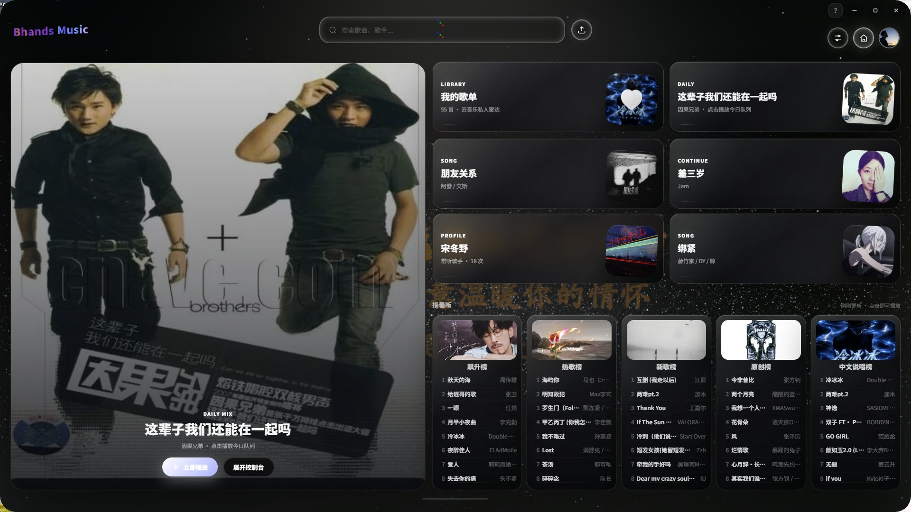
  
  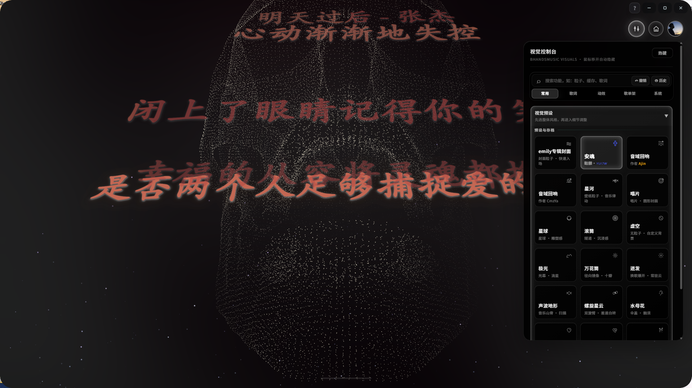
  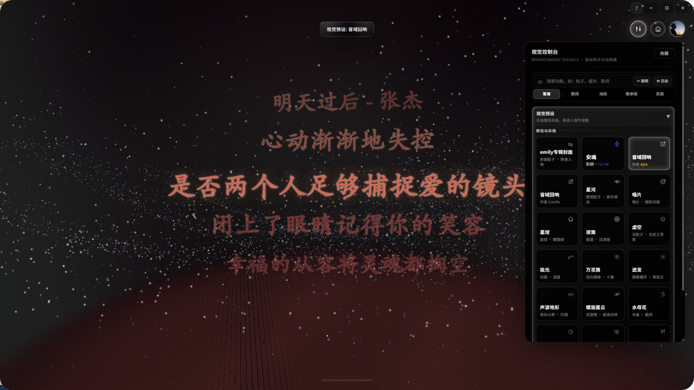
  
  
  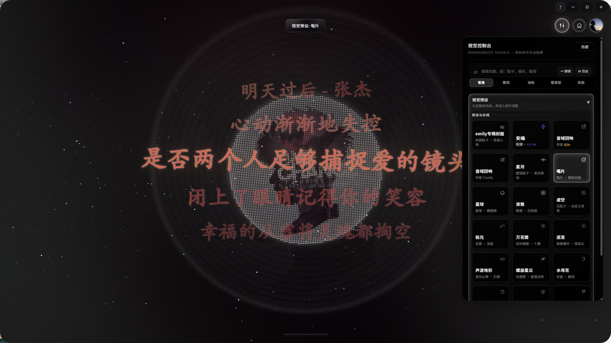
  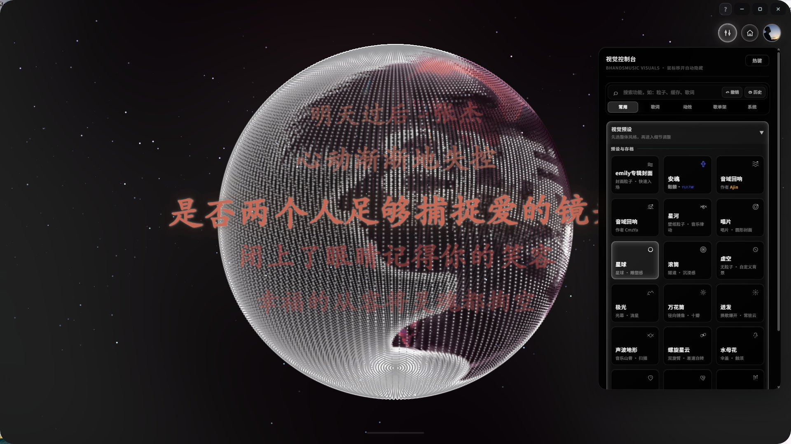
  
  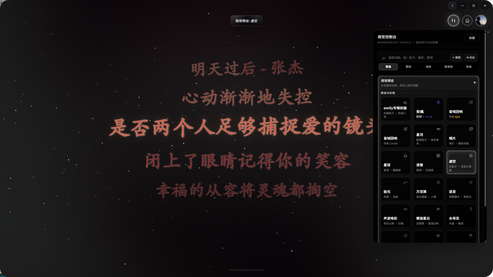
  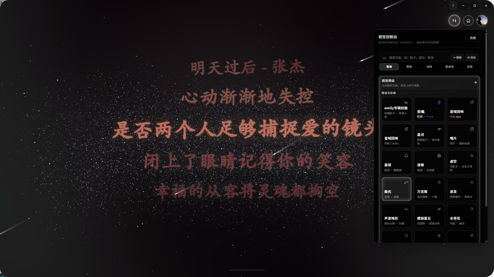
  
  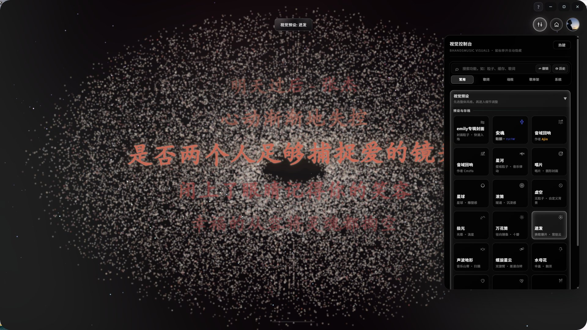
  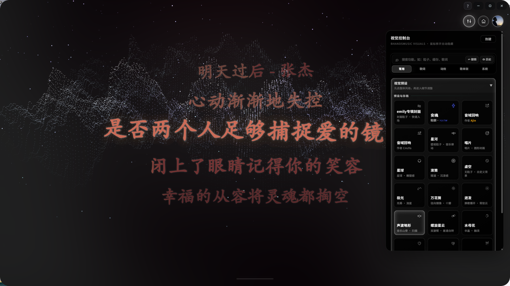
  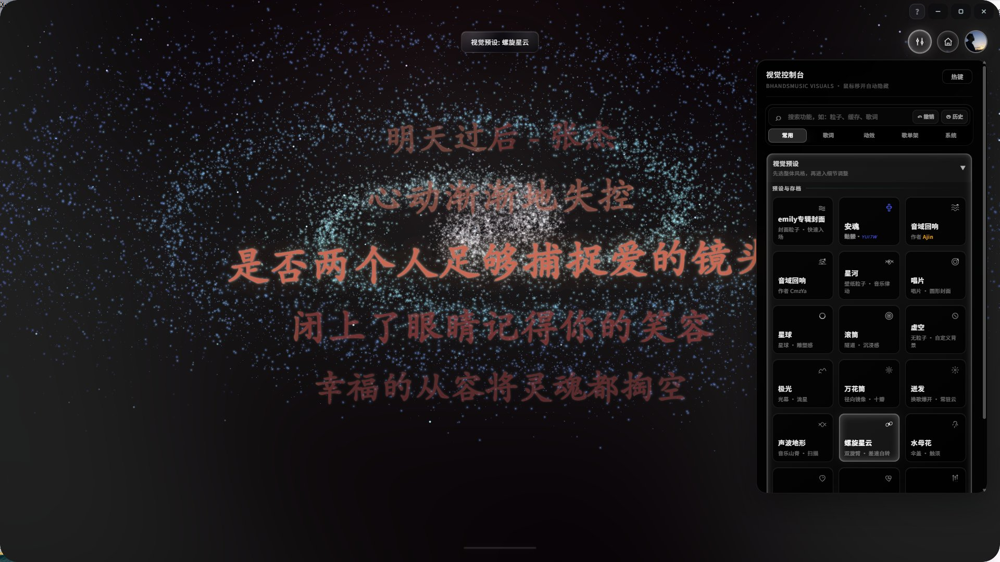
  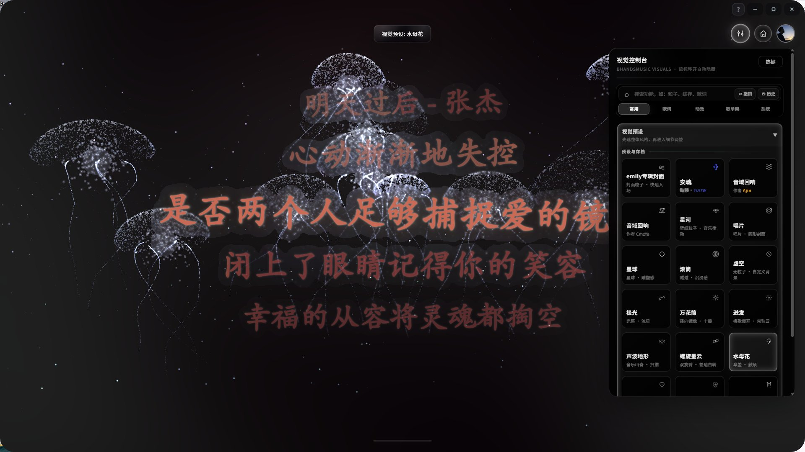
  
  
  
</p>

</details>

## 开发运行

```bash
npm install
npm start
npm run build:win
```

桌面版入口由 Electron 主进程加载本地服务。`npm run build:win` 会生成 Windows NSIS 安装包，产物位于 `dist/`。

## 第三方音乐平台说明

BhandsMusic 不是网易云音乐、QQ 音乐或腾讯音乐娱乐集团的官方客户端，也不隶属于任何音乐平台。

项目中的第三方平台接入仅用于个人学习、本地客户端体验和用户自有账号的播放辅助。请遵守对应平台的用户协议、版权规则和会员权益规则。

## 用户数据与隐私

登录 Cookie、搜索历史、自定义封面、自定义歌词、节奏分析缓存等数据只应保存在本机用户数据目录或浏览器本地存储中，不应提交到仓库。


## 版权与授权

Copyright (C) 2026 XxHuberrr.

本项目采用 GPL-3.0 授权。详见 [LICENSE](./LICENSE)。

BM Logo、BhandsMusic 名称、界面视觉设计与原创视觉表达归作者所有；第三方依赖和第三方服务分别遵循其各自授权与服务条款。
