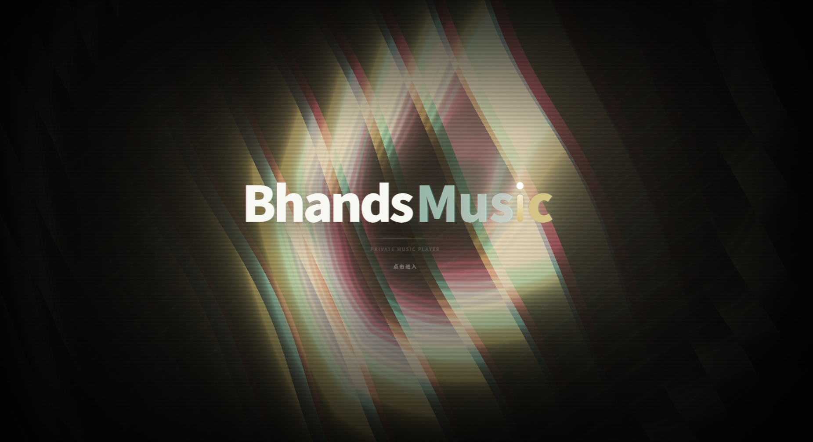
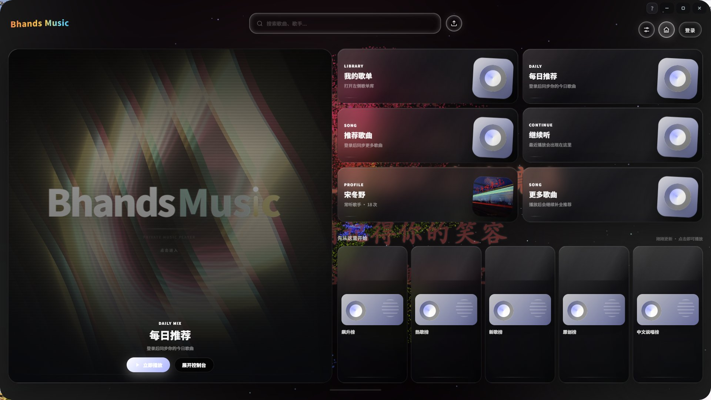
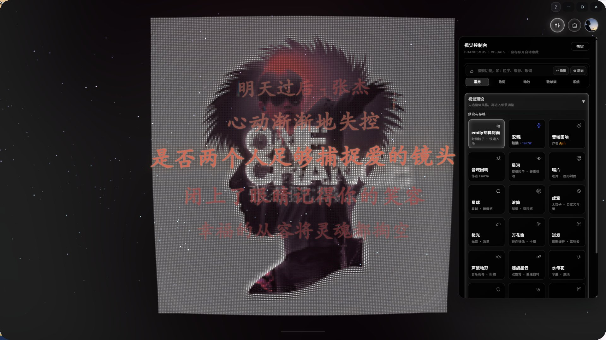
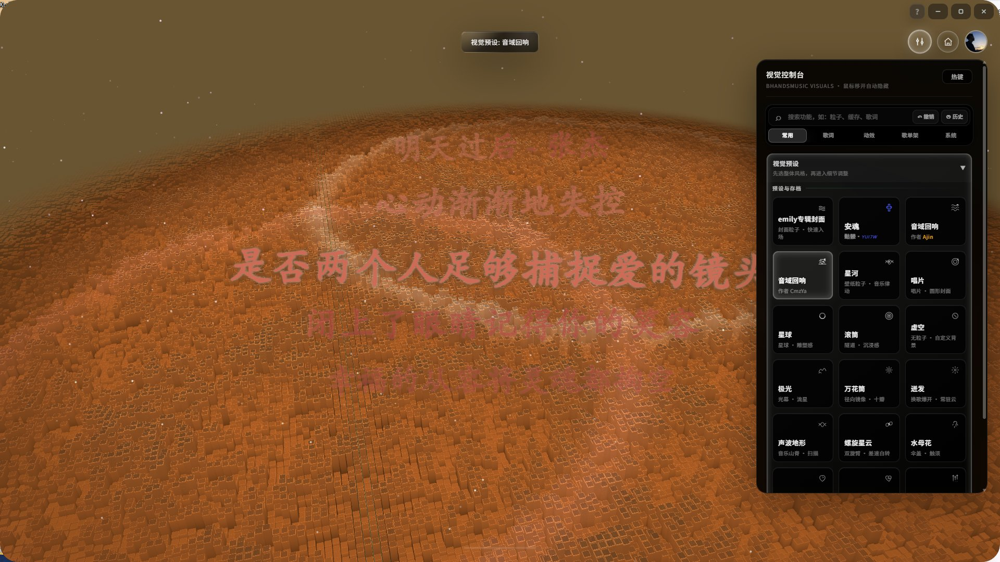
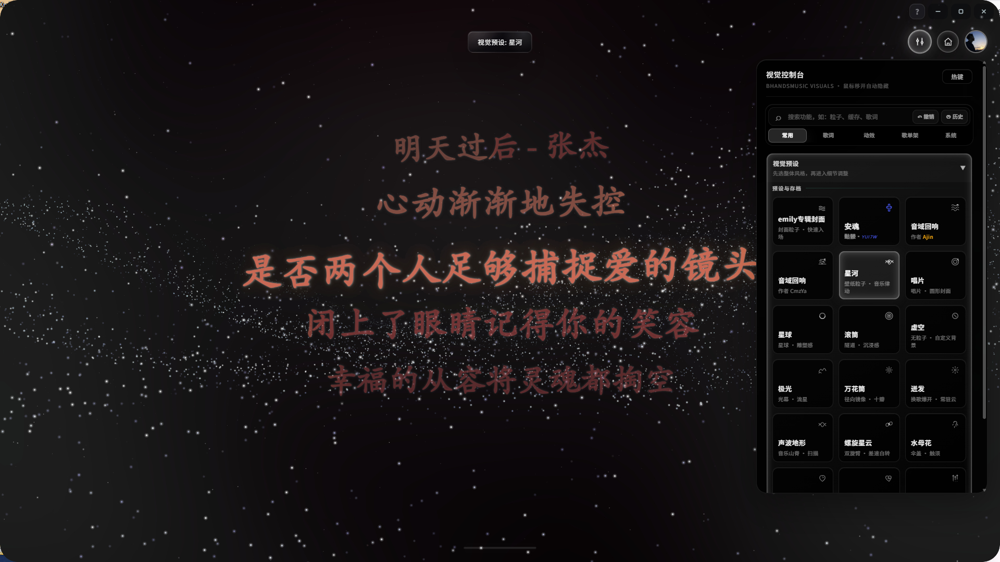
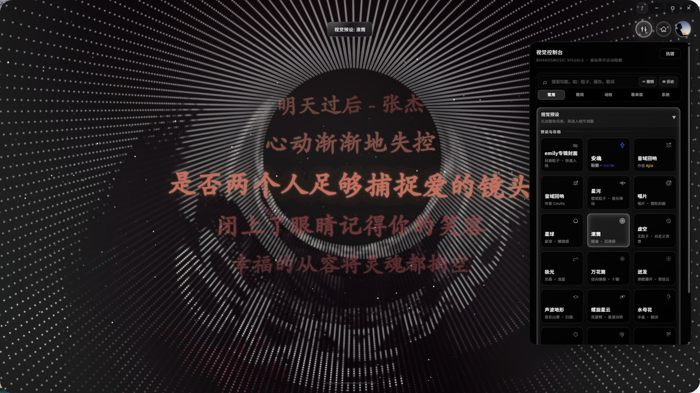
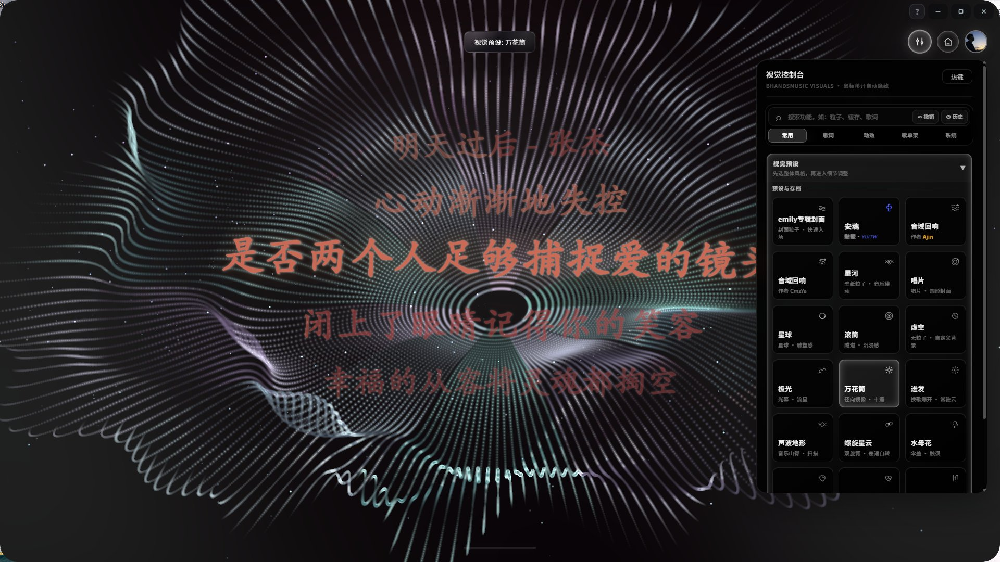
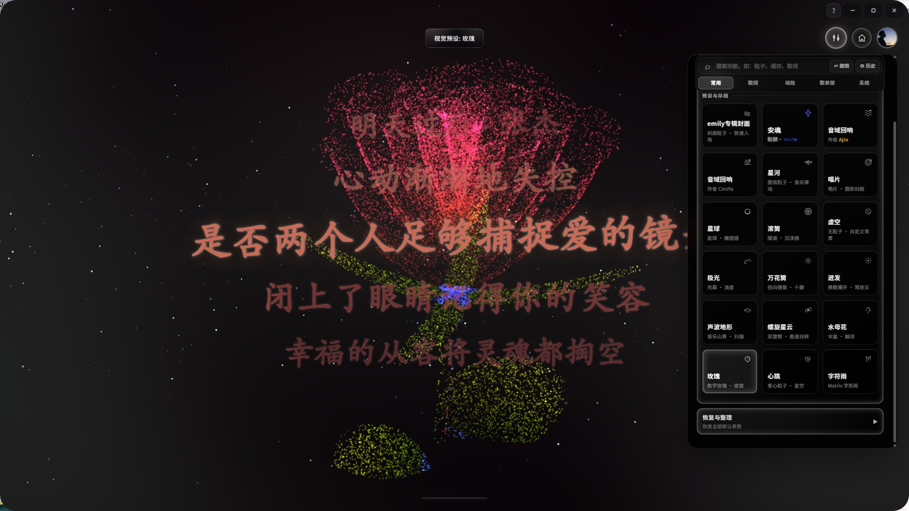
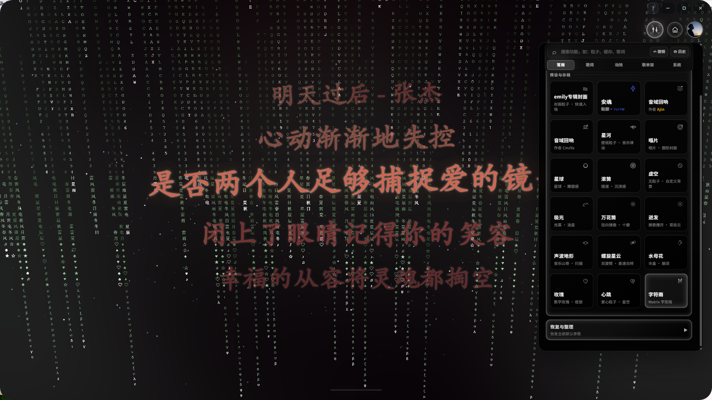

<h1 align="center">
  <span style="background: linear-gradient(90deg, #00f5d4, #00bbf9, #9b5de5, #f15bb5); -webkit-background-clip: text; -webkit-text-fill-color: transparent; font-size: 3em;">✦ BhandsMusic ✦</span>
  <br>
  <sub style="color: #888; font-size: 0.4em;">沉浸式音乐播放器 · 粒子视觉 · 3D 歌单架 · 多音源解析</sub>
</h1>

BhandsMusic 是一款沉浸式桌面音乐播放器，把「听歌」做成一个完整的现场：多音源解析兜住曲库，18 种 GLSL 粒子视觉随节拍实时生长，3D 歌词舞台与歌单架让界面本身成为演出的一部分。
本项目基于开源项目 [Mineradio](https://github.com/XxHuberrr/Mineradio) 二次开发。

<p align="center">
  
</p>

## ✨ 界面预览

**首页**（未登录 / 登录）

<p align="center">
  
  
</p>

## 🌌 粒子视觉效果

播放态共 18 个视觉预设，右键唤出「视觉控制台」即可切换、搜索与收藏；全部效果由 GLSL 粒子着色器实时驱动，随音乐节拍与频谱联动：

| | | |
|:---:|:---:|:---:|
| <br>**emily专辑封面** | <br>**滚筒** | <br>**星球** |
| <br>**虚空** | <br>**唱片** | <br>**星河** |
| <br>**安魂** | <br>**音域回响** | <br>**音域回响** |
| <br>**极光** | <br>**万花筒** | <br>**迸发** |
| <br>**声波地形** | <br>**螺旋星云** | <br>**水母花** |
| <br>**玫瑰** | <br>**心跳** | <br>**字符雨** |

## 立即下载 Windows 安装包

**当前版本：`v2.0.0`** → [点击下载最新版](https://github.com/Bhands6/BhandsMusicChange/releases/latest)


## 核心特性

- **多音源解析**：支持 GD音乐台、UnblockNeteaseMusic、LX Music 脚本、自定义 API 四种第三方音源
- **智能音源选择**：VIP/SVIP 用户优先走官方高质量音源，非 VIP 用户优先走第三方免费音源
- **音质自动降级**：第三方音源尽量使用最高质量（flac），不可用时自动降级到 320k、128k
- **LX Music 脚本支持**：通过沙盒执行用户上传的 LX Music 音源脚本
- Open-Meteo 天气电台，根据当前位置、城市和天气 mood 生成更合适的播放队列
- 首页包含天气电台、每日推荐、私人电台、继续听、听歌画像和我的歌单入口
- Wallpaper 银河首页背景，未播放状态保持干净的星河氛围
- 播放后切换到 Emily / 默认播放态视觉，歌词舞台与粒子舞台同步工作
- 基于节奏的电影镜头视觉系统
- 面向长播客和 DJ 曲目的专属视觉模式
- 歌词舞台、自定义歌词、歌词位置与视觉控制
- 自定义专辑封面上传与裁剪
- 右键唤起 3D 歌单架，支持歌单队列浏览
- 网易云音乐账号、搜索、歌单、播客等体验接入
- QQ 音乐搜索、登录态与音源补充接入
- GitHub Releases 更新检测与下载入口（支持轻量补丁与完整安装包，多线路自动切换）
- 首次启动内置「默认测试」视觉用户存档，软件内默认视觉参数与该存档一致


## 开发运行

```bash
npm install
npm start
npm run build:win
```

桌面版入口由 Electron 主进程加载本地服务。`npm run build:win` 会生成 Windows NSIS 安装包，产物位于 `dist/`。

## 📁 项目结构

```
BhandsMusicChange/
├── desktop/                          # Electron 主进程
│   ├── main.js                       # 窗口 / IPC / 托盘 / 更新 / 桌面歌词 / 壁纸
│   ├── preload.js                    # 渲染进程安全桥（desktopWindow API）
│   ├── overlay-preload.js            # 桌面歌词 / 壁纸窗口桥
│   ├── go-music-service.js           # 内置换源服务托管
│   ├── local-music-library.js        # 本地音乐库
│   └── system-memory.js              # 系统资源监控
│
├── public/                           # 渲染端（界面 + 视觉）
│   ├── index.html                    # 主界面
│   ├── close-dialog.html             # 关闭确认对话框
│   ├── desktop-lyrics.html           # 桌面歌词独立窗口
│   ├── wallpaper.html                # 壁纸模式窗口
│   ├── default-user-fx-archive.json  # 内置「默认测试」视觉存档
│   ├── js/
│   │   ├── app/                      # 前端主体（原 main.js 按职责拆成 19 个文件）
│   │   │   ├── 00-prelude.js         # 跨 script 函数提升垫片（必须排第一）
│   │   │   ├── 01-state.js           # 全局状态与默认参数
│   │   │   ├── 02-scene.js           # Three.js 场景 / 相机 / 轨道
│   │   │   ├── 03-particles.js       # 粒子几何与着色器
│   │   │   ├── 04-lyrics.js          # 歌词渲染与舞台布局
│   │   │   ├── 05-lyrics-stage.js    # 歌词 3D 舞台（mesh / 纹理 / 光晕）
│   │   │   ├── 06-cover.js           # 专辑封面
│   │   │   ├── 07-beat.js            # 节拍与频谱分析
│   │   │   ├── 08-shelf.js           # 3D 歌单架
│   │   │   ├── 09-api-search.js      # 搜索
│   │   │   ├── 10-audio-queue.js     # 音频与播放队列
│   │   │   ├── 11-playlist.js        # 歌单
│   │   │   ├── 12-fx-console.js      # 视觉控制台
│   │   │   ├── 13-system-panels.js   # 系统面板
│   │   │   ├── 14-account.js         # 账号（网易云 / QQ）
│   │   │   ├── 15-update.js          # 更新检测与下载
│   │   │   ├── 16-idle-toast-libs.js # 空闲态 / 提示 / 第三方库
│   │   │   ├── 17-shell.js           # 窗口外壳（标题栏 / 沉浸式 / 控制按钮）
│   │   │   └── 18-session-boot.js    # 会话恢复与启动流程
│   │   ├── web-fx-presets.js         # 18 个粒子预设（GLSL 分支 + 机位表）
│   │   ├── fx-console-workspace.js   # 视觉控制台面板注册表
│   │   └── cuefield-*.js             # Cuefield 自动混音桥接
│   ├── styles/main.css               # 主样式
│   ├── assets/                       # 图标 / 点云等资源
│   ├── media/                        # 启动动画视频
│   └── vendor/                       # 前端第三方资源
│
├── server/                           # 本地服务
│   ├── server.js                     # HTTP 服务 / 更新 / 音乐接口
│   ├── dj-analyzer.js                # DJ 长曲分析
│   └── music-sources/                # 多音源解析
│       ├── musicParser.js            # 解析编排与失败冷却
│       ├── gdmusic.js                # GD音乐台
│       ├── unblockMusic.js           # UnblockNeteaseMusic
│       ├── lxMusicRunner.js          # LX Music 脚本沙盒
│       ├── kugou.js                  # 酷狗音源
│       ├── kugouService.js           # 内置酷狗 API 服务
│       ├── goMusicSwitch.js          # 换源匹配（防货不对版）
│       └── durationProbe.js          # 时长探测
│
├── cuefield/                         # Cuefield 自动混音内核（规划 / 结构 / 桥接）
├── build/                            # 打包辅助
│   ├── fetch-go-music-api.js         # 拉取内置换源二进制
│   ├── fetch-kugou-api.js            # 拉取酷狗概念版 API
│   ├── fetch-splash-video.js         # 拉取启动动画
│   ├── after-pack.js                 # 打包后处理
│   └── installer.nsh                 # NSIS 安装脚本定制
│
├── scripts/                          # 验证探针与闸门
│   ├── probe-*.js                    # 离屏 Electron 实测探针（UI / 取景 / 歌词）
│   ├── check-app-hoisting.js         # 跨 script 函数提升校验
│   ├── check-app-reorg.js            # 加载期读写顺序等价校验
│   ├── lib/                          # 公共库（AST 扫描等）
│   └── reorg/                        # 重排基线与迁移工具
│
├── tests/                            # 单元测试（node --test）
├── docs/                             # 项目文档与界面截图
├── vendor/                           # 构建前按需拉取的内置服务（不入库）
└── dist/                             # 打包产物（NSIS 安装包）
```

## 第三方音乐平台说明

BhandsMusic 不是网易云音乐、QQ 音乐或腾讯音乐娱乐集团的官方客户端，也不隶属于任何音乐平台。

项目中的第三方平台接入仅用于个人学习、本地客户端体验和用户自有账号的播放辅助。请遵守对应平台的用户协议、版权规则和会员权益规则。

## 用户数据与隐私

登录 Cookie、搜索历史、自定义封面、自定义歌词、节奏分析缓存等数据只应保存在本机用户数据目录或浏览器本地存储中，不应提交到仓库。


## 版权与授权

Copyright (C) 2026 XxHuberrr.

本项目采用 GPL-3.0 授权。详见 [LICENSE](./LICENSE)。

BM Logo、BhandsMusic 名称、界面视觉设计与原创视觉表达归作者所有；第三方依赖和第三方服务分别遵循其各自授权与服务条款。
